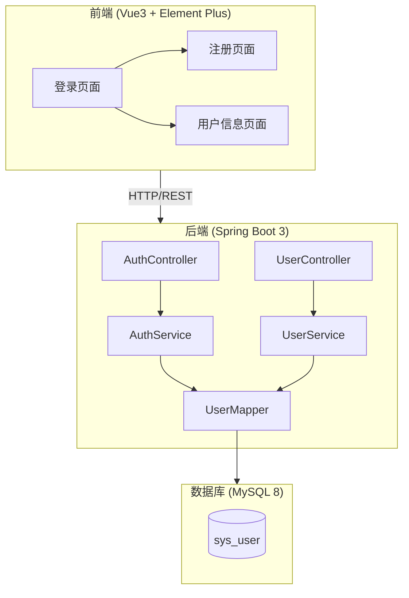
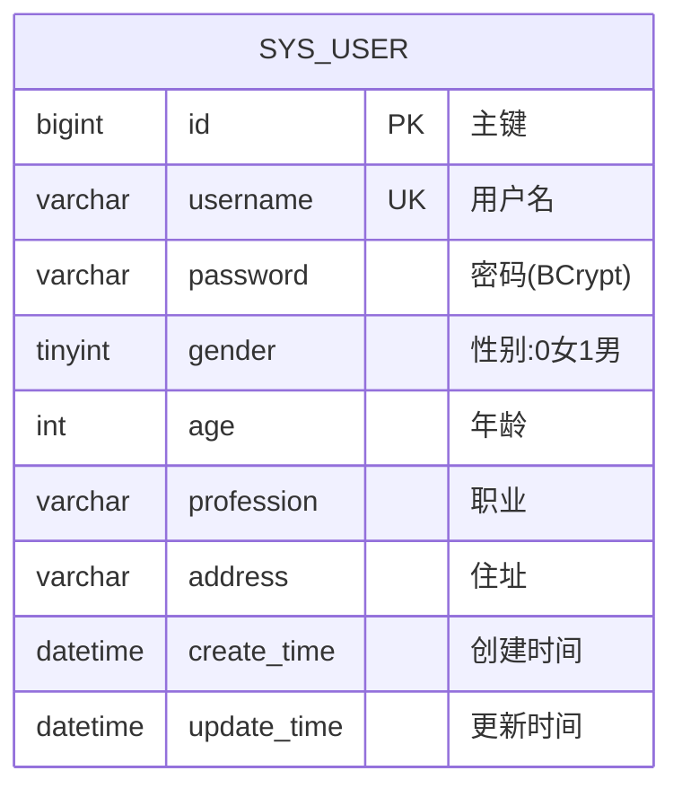

# 用户管理系统 - 项目设计文档

## 1. 系统架构

## 2. ER 图

## 3. 接口清单

### AuthController - 认证接口
| 方法 | 路径 | 描述 |
|------|------|------|
| POST | /api/auth/register | 用户注册 |
| POST | /api/auth/login | 用户登录 |

### UserController - 用户接口
| 方法 | 路径 | 描述 |
|------|------|------|
| GET | /api/user/info | 获取当前用户信息 |
| PUT | /api/user/info | 更新用户信息 |

## 4. UI/UX 规范

- **主色调**: #409EFF (Element Plus 默认蓝)
- **成功色**: #67C23A
- **警告色**: #E6A23C
- **危险色**: #F56C6C
- **字体**: -apple-system, BlinkMacSystemFont, "Segoe UI", Roboto
- **圆角**: 8px (卡片), 4px (按钮/输入框)
- **间距**: 8px / 16px / 24px
- **阴影**: 0 2px 12px rgba(0,0,0,0.1)
